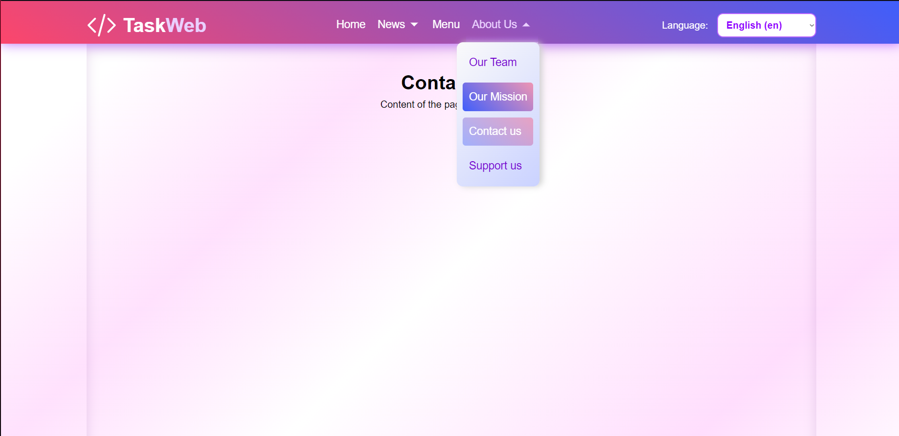

# TaskWeb

This is a little Django project that contain a ready-made website header and nav bar that can be used as a template for any website. It also contains a simple language switcher that can be used to translate the website into different languages.

## Features

This project implements a ready-made website header that contains a logo, navigation and a language switcher. The navigation itself contains working links and sublinks.  All menu options are dynamically selected from the database, which makes it easy to add and edit navigation. 



The project also supports translation into 4 languages: 
- English
- French 
- German
- Ukrainian.

But you can also add more if you want.

## Getting Started

These instructions will get you a copy of the project up and running on your local machine for development and testing purposes.

### Prerequisites

You need to have the following installed on your system:

- Python
- pip
- virtualenv (optional)

### Installing

1. Clone the repository
```bash
git clone https://github.com/Roman1375/TaskWeb.git
```

2. Navigate to the project directory
```bash
cd path/to/project
```

3. Install the required Python packages
```bash
pip install -r requirements.txt
```

4. Migrate the database
```bash
#Make migrations
python manage.py makemigrations

# Run the migrations
python manage.py migrate
```

5. Run the Django server
```bash
# Run the server
python manage.py runserver
```

## Built With

- [Django](https://www.djangoproject.com/) - The web framework used
- [JavaScript](https://developer.mozilla.org/en-US/docs/Web/JavaScript) - Used for interactivity
- [SCSS](https://sass-lang.com/) - Used for styling